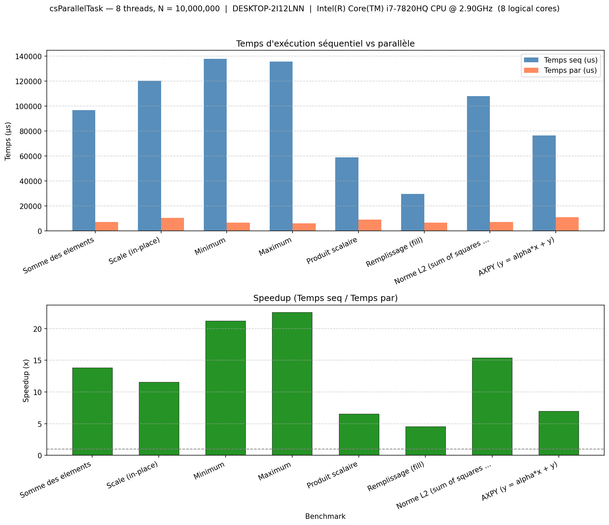

# csParallelTask Library

## Overview

The csParallelTask library is a powerful and flexible parallelization solution for C++ that simplifies leveraging modern multi-core architectures. It provides a structured framework for dividing intensive tasks into work blocks that can be executed simultaneously across different threads.

## Key Features

- 🧩 **Simplified Parallelization**: Easily transform sequential operations into parallel processes without directly managing thread complexities.
- 🔄 **Automatic Adaptation**: Dynamically adjusts to the number of available cores on the machine for optimal resource utilization.
- 📦 **Flexible Argument Management**: Advanced mechanisms for passing and sharing data between worker threads.
- ⏱️ **Integrated Performance Measurements**: Precise timing tools (`CSPERF_CHECKER`) to evaluate performance gains.
- 🎮 **Execution Control**: Options for synchronous or asynchronous (background) executions.
- 🔓 **Task Lifecycle**: Register tasks with `registerFunction*`, unregister with `unregisterFunction` or `unregisterAll`.

## Complex Tasks Optimized by csParallelTask

1. 🖼️ **High-Resolution Image Processing**: Divide an image into sections and apply filters or transformations in parallel, significantly reducing processing time.
2. 🔬 **Scientific Simulations**: Distribute intensive numerical calculations across multiple cores to accelerate physical, chemical, or other complex mathematical models.
3. 📊 **Large Data Analysis**: Process big datasets in parallel, with automatic load distribution among available threads.
4. 🔍 **Search and Sorting Algorithms**: Efficiently implement parallel search or sorting algorithms on large data collections.
5. 🧮 **Matrix Computations**: Perform operations on large matrices by dividing the work into blocks for optimal performance.
6. 🎨 **Graphical Rendering**: Accelerate 3D rendering calculations by parallelizing operations by zones or objects.
7. 🗜️ **Data Compression/Decompression**: Process multiple data segments simultaneously to improve compression algorithm performance.
8. 🌳 **Tree Traversals**: Explore complex tree structures in parallel for applications.

## Core Components

### CSPARGS
Manages arguments and boundaries for parallel work blocks, providing a clean interface for thread communication. Use `clear()` to free resources before discarding.

### CSPERF_CHECKER
Offers precise timing capabilities (nanoseconds to hours) to measure and optimize parallel execution performance.

### csParallelTask Namespace
Contains the main functionality for creating, managing, and executing parallel tasks: `registerFunction*`, `execute`, `unregisterFunction`, `unregisterAll`, `setBufferShapeRegular`, `updateArg`, etc.

## Benefits

The csParallelTask library eliminates the usual complexity of parallel programming by providing high-level abstractions that allow developers to focus on their business logic rather than thread implementation details. With its intuitive API and optimized performance, it represents an ideal solution for modern applications requiring efficient use of multi-core computing resources.

## Usage Example

```cpp
// Register a parallel function with regular work distribution
size_t taskId = csParallelTask::registerFunctionRegularEx(
    8,                  // Number of blocks/threads (adapts to CPU cores)
    dataSize,           // Total work size to process
    "processData",      // Task name
    &processDataFunc,   // Function pointer
    2,                  // Number of arguments
    &inputData,         // Arg 1: Input data pointer
    &results            // Arg 2: Results container pointer
);

// Execute the parallel task
csParallelTask::execute(taskId);

// When done
csParallelTask::unregisterFunction(taskId);
```

## Performance Measurement

```cpp
// Measure execution time
CSPERF_CHECKER perf(CSTIME_UNIT_MICROSECOND);
perf.start();
csParallelTask::execute("processData");
perf.stop();
perf.printReport("Data processing completed in: ");
```

## Benchmark Program and Visualization

The `main.cpp` test program runs 11 benchmarks comparing sequential vs parallel execution:

1. Somme des éléments  
2. Scale (in-place)  
3. Minimum, 4. Maximum  
5. Produit scalaire  
6. Remplissage (fill)  
7. Norme L2  
8. Exécution par nom  
9. Resize + updateArg  
10. AXPY (y = alpha*x + y)  
11. Tri par segments  

A Python script generates bar charts from the benchmark output:

```bash
# Run the benchmark and save output
build\csParallelTask_test.exe > sortie.txt

# Generate chart (requires matplotlib)
pip install matplotlib
python scripts/plot_benchmark.py sortie.txt
# Or: build\csParallelTask_test.exe | python scripts/plot_benchmark.py
```

The figure is saved as `csParallelTask_benchmark.png` with machine characteristics in the title.



---

## ⚙️ Build Instructions

### 🔷 Windows (MSYS2 + g++)
```bash
pacman -S mingw-w64-x86_64-toolchain cmake
mkdir build && cd build
cmake .. -G "MinGW Makefiles" -DCMAKE_BUILD_TYPE=Release
mingw32-make
```

### 🔷 Windows (build.cmd)
```cmd
build.cmd
```

### 🔷 Windows (MSYS2 CLANG64)
```bash
pacman -S mingw-w64-clang-x86_64-toolchain cmake ninja
mkdir build && cd build
cmake .. -G Ninja
ninja
```

### 🐧 Linux / 🍎 macOS
```bash
sudo apt install g++ cmake ninja-build   # Or use clang++
mkdir build && cd build
cmake .. -G Ninja -DCMAKE_BUILD_TYPE=Release
ninja
```

> **Note:** The `build/` directory is listed in `.gitignore` and should not be versioned.

## 📁 Directory Structure

```
csParallelTask/
├── include/                    # Public headers
│   ├── csParallel.h
│   ├── csPargs.h
│   └── csPerfChecker.h
├── src/                        # Source files
│   ├── csParallel.cpp
│   ├── csPargs.cpp
│   ├── csPerfChecker.cpp
│   └── main.cpp                # Benchmark & usage examples
├── scripts/                    # Helper scripts
│   ├── build.cmd               # Configure & build (Windows)
│   ├── compile_execute_main.cmd# Build & run benchmark executable
│   └── plot_benchmark.py       # Benchmark visualization
├── docs/
│   └── csParallelTask_API.md   # API reference
├── others/                     # Extra sample codes (e.g. matrix multiply)
|── libs/                       # Generated library for quick use
├── README.md
└── LICENSE.txt
```

## 📜 License
This project is licensed under the MIT License. See the LICENSE file for details.

## ✉️ Contributions
Feedback, issues, and pull requests are welcome.
This library is part of the CSigma initiative to empower developers with efficient and scientifically grounded C++ tools.
